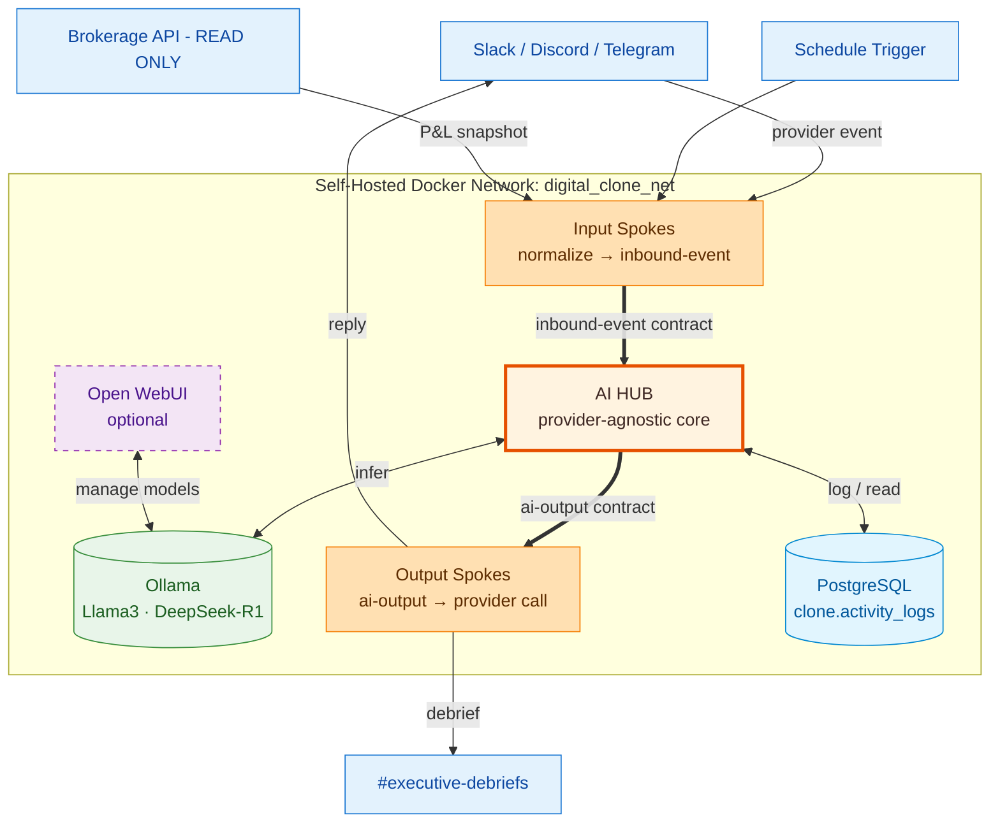

# Architecture Diagram

**Read it as three layers:**

1. **Spokes (blue)** — provider-specific. Replaceable. They speak HTTP/SDK on one
   side and the **contracts** on the other.
2. **Hub (orange, bold)** — provider-agnostic. The only thing that talks to the model.
   It accepts `inbound-event`, returns `ai-output`, and never imports a provider SDK.
3. **Infra (green/blue)** — Ollama (compute) + Postgres (state), plus optional Open WebUI.

The `==>` edges are the **contract boundaries** — the two interfaces in
[`/contracts`](../../contracts/). Everything to the left of `inbound-event` and to
the right of `ai-output` is swappable without touching the Hub.
